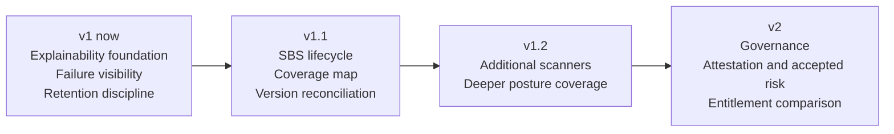

# Salesforce Security Observatory Roadmap

Status: public roadmap
v1 status: in active development
Last reviewed: 2026-06-19

Salesforce Security Observatory is a read-only Salesforce security evidence tool.

It helps Salesforce teams review security posture by collecting sanitised scan evidence, showing compound risk, identifying native-control blind spots, and comparing retained scans over time. Security Benchmark for Salesforce alignment is planned as an explicit v1.1 foundation once the local registry, mappings and coverage map are implemented.

This project is an independent reference implementation. It is not affiliated with Salesforce or the Security Benchmark for Salesforce project.

## At a glance

## What Observatory adds

A feature stays in scope only if it adds at least one of the following:

| Value | Meaning |
|---|---|
| Explainable evidence | Shows source, coverage status, posture, verification path, limitation and Observatory value-add. |
| Compound-risk correlation | Combines signals across users, permissions, OAuth, API access, sessions, endpoints, certificates, and licences. |
| Native blind-spot visibility | Shows when a Salesforce-native capability is unavailable, disabled, not configured, or outside the current scan scope. |
| Drift and comparison | Shows what changed between retained scans. |

Where Salesforce already provides the core native capability, Observatory links to it or summarises it instead of duplicating it.

## v1 now

v1 focuses on trustworthy, explainable, short-term operational evidence.

| Area | Scope |
|---|---|
| Dashboard clarity | Clear dashboard cards with source, coverage status, posture, safe verification help, limitation and Observatory value-add where implemented. |
| Failure visibility | Scanner failures show as Unknown/Error, never as a false Pass. |
| Retention discipline | Salesforce retains only the latest 3 completed scans once the v1 retention default correction is applied. |
| Safe export | CSV export is available for retained evidence and is protected against formula injection. |
| Scan comparison | Completed scans can be compared using retained evidence. SBS-aware version mismatch warning is v1.1 scope. |
| Native blind spots | Cards show when a native Salesforce capability is unavailable, disabled, not configured, or outside the current scan scope. |
| No remediation | Observatory reports posture only. It does not change security settings. |

## v1 exclusions

v1 does not include:

| Exclusion | Decision |
|---|---|
| Automatic remediation | No token revocation, API blocking, permission removal, endpoint change, certificate change, or key rotation. |
| AI summaries | No AI or Gemini advisory summaries. |
| Event Monitoring ingestion | No high-volume event-log ingestion. |
| Security Center clone | No attempt to replace Salesforce-native security products. |
| External warehouse sync | Long-term evidence storage is customer-owned and outside the app. |
| Scheduled scans | v1 is manual. |
| Formal SBS compliance claim | v1 does not provide certification, compliance scoring, or a formal SBS compliance claim. |
| SBS control registry and coverage map | Local SBS metadata, static scanner-to-SBS mapping, admin XML upload and SBS coverage map are v1.1 scope. |

## v1.1 next

v1.1 focuses on SBS lifecycle management, safer version comparison, and native capability expansion.

| Area | Direction |
|---|---|
| SBS-aligned evidence | Add static scanner-to-SBS mapping once local metadata is available. |
| SBS coverage map | Show Automated, Partial Evidence, Manual Required, Not Covered and Extended Check. |
| Local SBS metadata registry | Ship bundled SBS XML and support controlled admin upload of updated SBS XML. |
| SBS version reconciliation | Show controls added, removed, renamed, or changed between installed SBS versions. |
| Safer cross-version comparison | Compare scans run under different SBS versions without silent control-by-control mismatch. |
| SBS upload history | Expand the upload log into a richer version history. |
| SBS registry rollback | Support rollback using retained registry snapshots. |
| Native capability register | Expand Setup paths, licence dependencies, posture, limitations, and Observatory action per card. |
| Connected App and External Client App posture | Improve posture visibility where metadata access is safe and reliable. |
| API Access Control posture | Detect and explain posture where feasible without remediation. |
| Storage indicator and production scan warning | Show retained evidence footprint indicators and warn before additional production manual scans. |
| Storage estimate improvement | Improve retained evidence footprint estimates. |
| Source-org awareness | Harden scan and comparison labels for future multi-org support. |

## v1.2 later

v1.2 may add more scanner coverage after v1 and v1.1 stability work is complete.

| Area | Direction |
|---|---|
| Public Content links | Optional scanner for public file or link exposure. |
| Field History Tracking | Optional scanner for configured sensitive-field lists. |
| Sites and Experience depth | Expand baseline exposure checks where safe. |
| Transaction Security | Inventory only, no blocking or remediation. |
| Permission source depth | Improve Profile, Permission Set, and Permission Set Group risk visibility. |
| Licence alignment | Improve over-licensed, missing-access, and unexpected-access views. |
| Historical baselines | Add daily, weekly, and monthly labels if storage-safe. |

## v2 future

v2 focuses on governance evidence and review workflows.

| Area | Direction |
|---|---|
| Manual attestation | Capture governance evidence for controls that cannot be scanned. |
| N/A justification | Explain controls that do not apply. |
| Accepted risk | Track owner, expiry, justification, and review status. |
| Functional role entitlement comparison | Compare expected access against actual access by role. |
| Historical drift reporting | Report repeated, worsened, improved, and resolved posture. |
| External reporting model | Provide replication-ready reporting objects or views. |
| Framework export | Export SBS-aligned evidence for wider governance reporting. |

## Synthetic data only

Everything shown in this project's public materials — examples, screenshots, and sample exports — comes from a development org using synthetic data, never customer data, org secrets, credentials, tokens, or real scan evidence.

## Maintainer

Maintained by SecuredForce Lab.

Contact: securedforcelab@gmail.com
LinkedIn: linkedin.com/in/lpacini

Security Benchmark for Salesforce (SBS) control references are used under [CC BY-SA 4.0](https://creativecommons.org/licenses/by-sa/4.0/). SBS is an independent project of the Salesforce-Security-Benchmark community — see [securitybenchmark.org](https://www.securitybenchmark.org).
